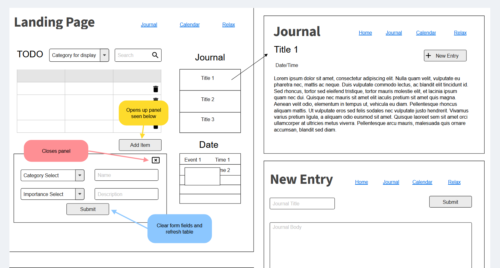
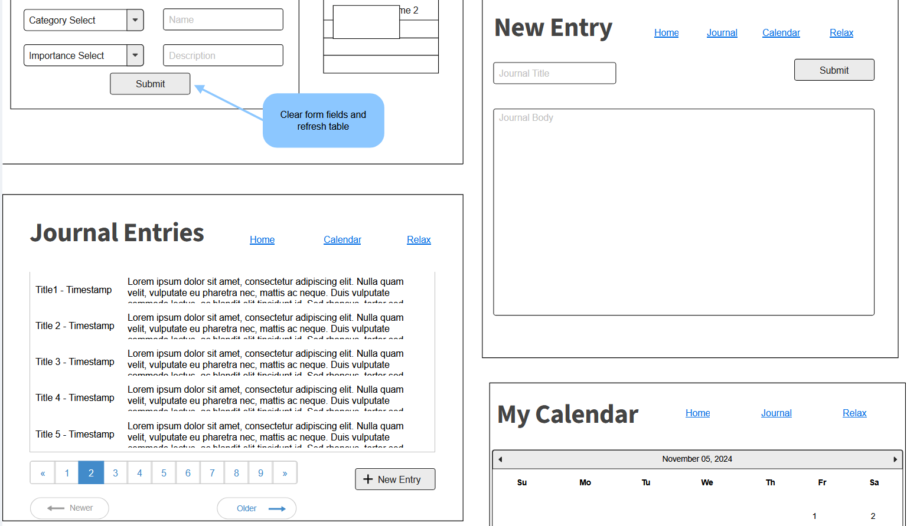
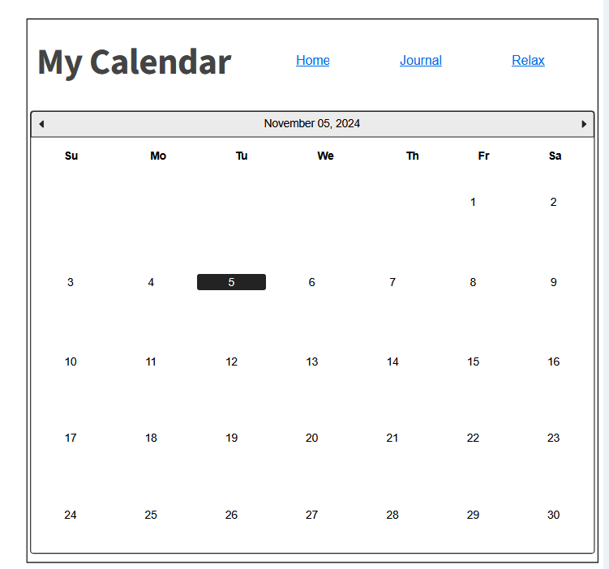
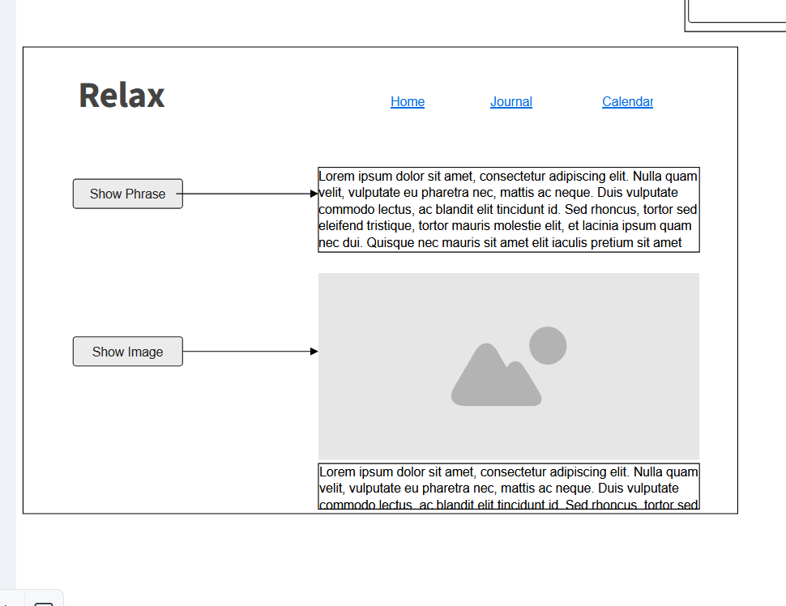

# Final Project: TODO Site

## Project Spec

I would like to design a TODO style website that also serves as a kind of journal.  The TODO will be focused on chores, with different chores falling under specific categories.  These categories will be things such as "Household" or "Financial" as an example of scope.  The landing page will start by showing all existing chores, will allow for sorting based on user set importance level (a whole number value where the lower the number the higher the level of importance).  It will also allow users to show only chores from a specific category or to search for a specific chore or chore(s) by name using a search bar.  There will be navigation buttons or links on the landing page that will take the user to 3 other pages: a journal page, a calendar page and what I'm calling the relaxation page.  On the original landing page I would like there to be a section that displays a few of the newest journal entries by title.  If these are clicked on it will take the user to a page showing the full entry.  From this page the user can either go to the journal page or back to the landing page.  On the journal page it will display the titles of all entries using pagination if necessary and will allow the user to write a new time stamped entry.  The calendar page will pretty much be what it sounds like.  A dedicated calendar for adding events.  It should default to the current date but allow for scrolling backward and forward through the months.  On the landing page there will be a display for the current date that shows any events associated with the date.  Finally I would like to include a page for when the user is feeling overwhelmed, this being the relaxation page.  On this page there will be a couple of buttons, one for showing the user a randomized affirmation and one for displaying cute images.  Both will randomly display from a pool of options when the buttons are pressed.  This site would be for a target audience of anyone looking for a digital solution to a daily planner/journal.  A stretch goal for me would be to have TODO list items have an optional date parameter.  If the date isn't set they would just go onto the TODO list as normal, but if there is a date then I would like the calendar to automatically include the TODO item as an event so the user would not have to double enter any time sensitive items.  Another would be to allow the user to upload their own sayings and media for the relaxation page in order to customize the space to best suit their tastes.  Finally I would like to add a media player to the relaxation page for playing soothing music or sounds, or even relaxing videos from a library of options.  I would tentatively like to have the bones of each page and the databases sorted out in the next two weeks.  In the two weeks that follow that I would like for all forms and retrievals to be implemented with tests written, though the testing does not have to be exhaustive.  With any remaining time I will work on stretch goals from first listed to last.  My highest priority is trying to make the site feel good to use with as little clunk as possible.  I will be trying to keep accessibility in mind for everything I design as well, both visually and in terms of usability and navigation.

## Project Wireframe

